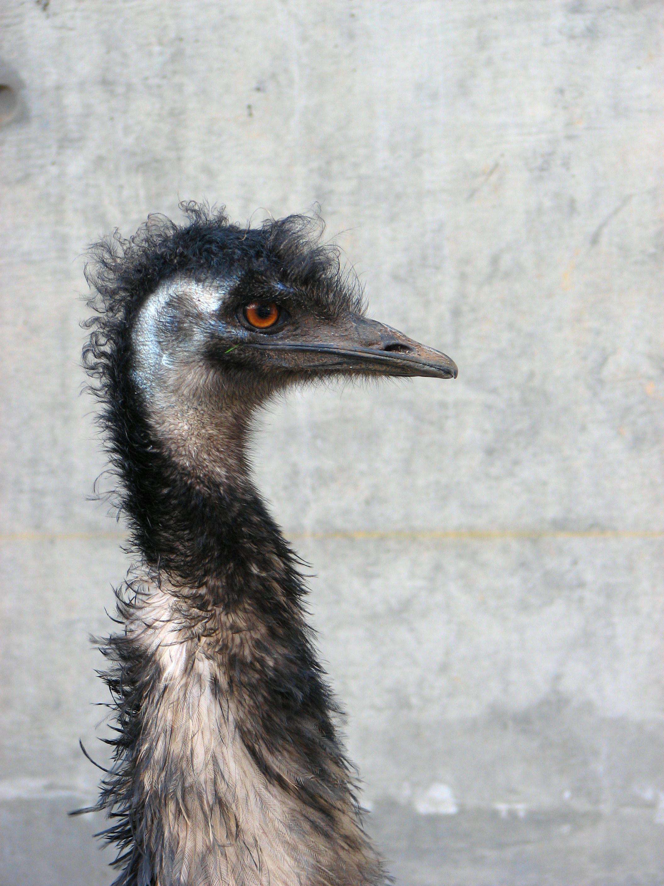

# Meticulous Object Segmentation

<p align="center">
   
   
   
   
   
   </p>
<p align="center">
  
  
  
</p>

This repository includes the official project of Meticulous Object Segmentation, presented in our paper:

**[Meticulous Object Segmentation](https://arxiv.org/pdf/2012.07181.pdf)**

[Johns Hopkins University](https://ccvl.jhu.edu/), [Adobe](https://www.adobe.com/)

## News

- 15 Dec 2020: Release [Arxiv version of paper](https://arxiv.org/pdf/2012.07181.pdf) and sample images and videos coming soon! 

## TODO
- Inference code and model weights
- MOS 600 Benchmark
- More visual examples

## Citation
```
@article{yang2020meticulous,
  title={Meticulous Object Segmentation},
  author={Yang, Chenglin and Wang, Yilin and Zhang, Jianming and Zhang, He and Lin, Zhe and Yuille, Alan},
  journal={arXiv preprint arXiv:2012.07181},
  year={2020}
}
```
## Lisence
Research only
